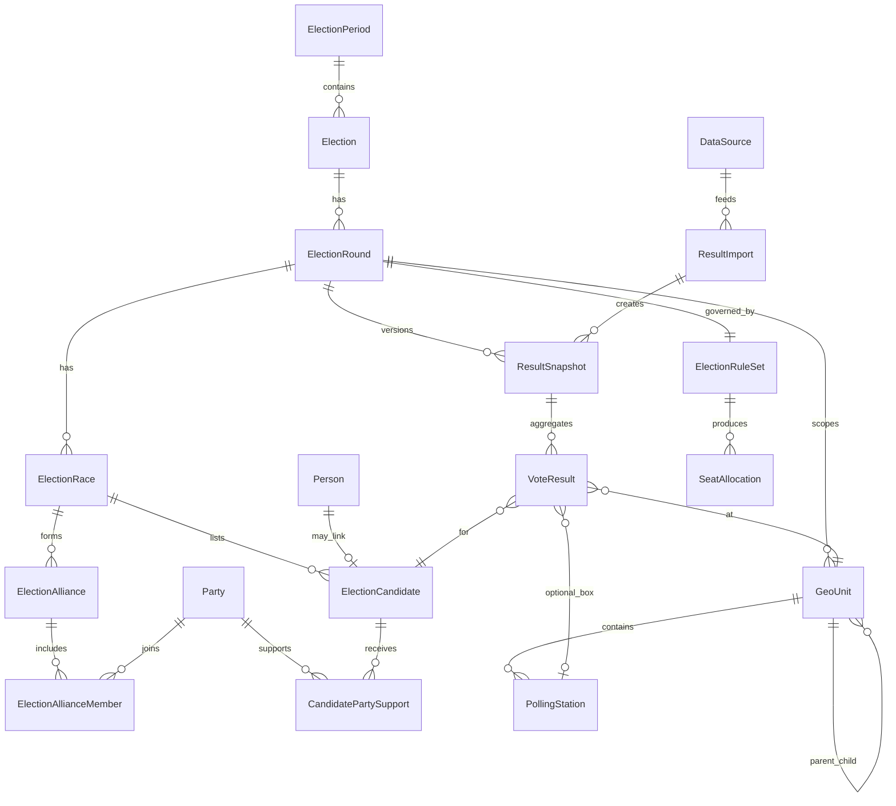
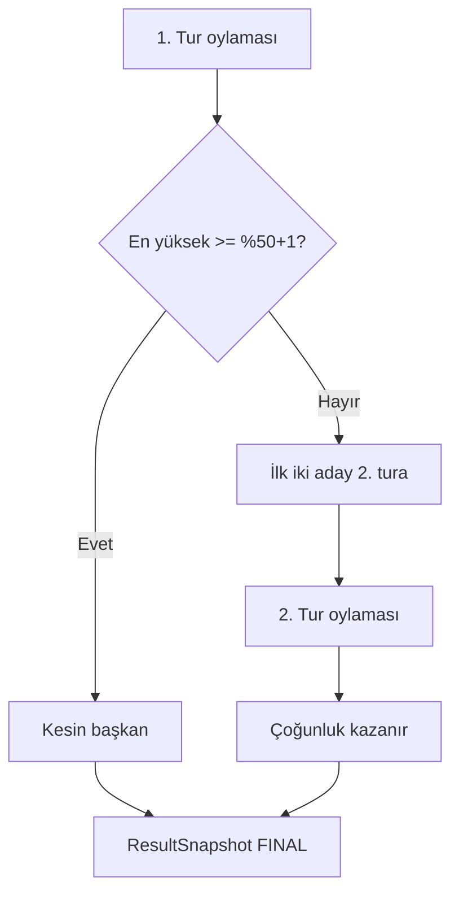
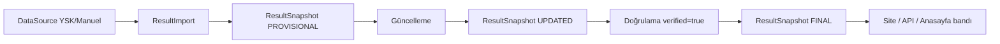
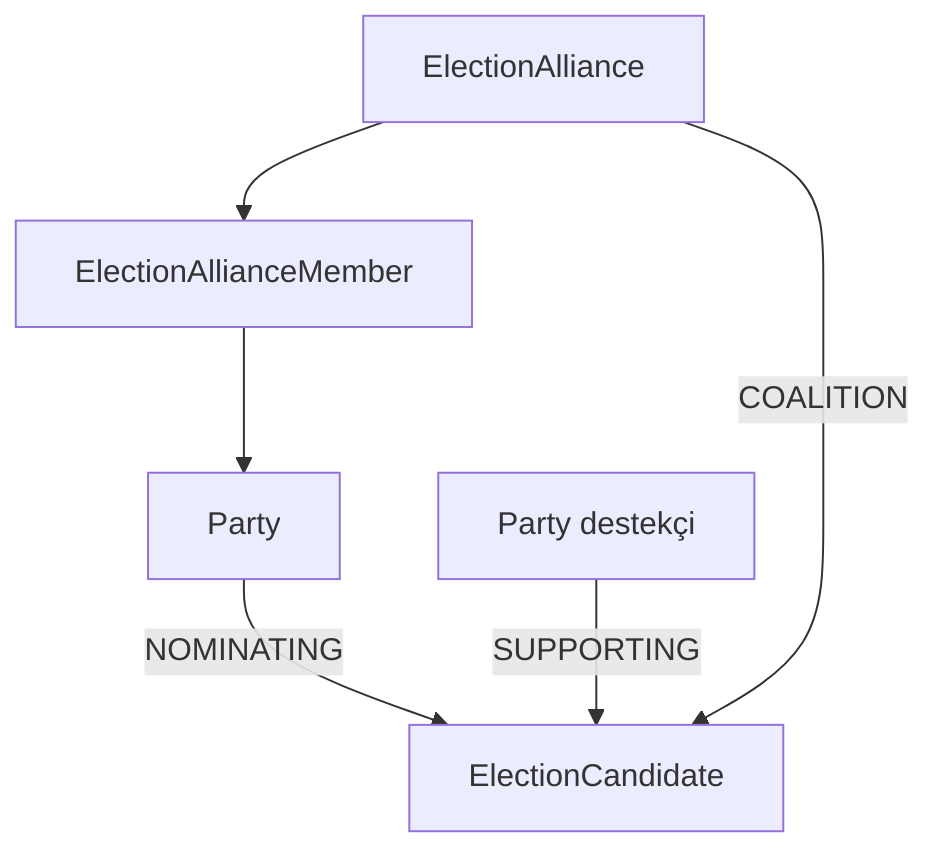

# Seçim Veri Motoru — Veri Modeli (v1)

> **Durum:** Tasarım kilidi — kodlamaya geçmeden önce onaylanacak.  
> **Mevcut kod:** `Election`, `ElectionCandidate`, `ElectionDistrict`, `ElectionDistrictResult` (yerel seçim vitrini, düz model).  
> **Hedef:** Tur, ittifak, çoklu parti desteği, sandık hiyerarşisi, kural motoru, sonuç versiyonlama, kaynak izlenebilirliği.

---

## 1. Mevcut ↔ Hedef boşluk analizi

| Alan | Şimdi | Hedef |
|------|--------|--------|
| Tur | Yok (tek `Election`) | `ElectionRound` (1./2. tur) |
| Parti | `partyName` string aday üzerinde | `Party` master + `CandidatePartySupport` |
| İttifak | Yok | `Alliance` + seçim bazlı `ElectionAlliance` |
| Kurallar | Yok | `ElectionRuleSet` (%50+1, D'Hondt, baraj…) |
| Coğrafya | İlçe | İl → ilçe → **sandık** |
| Sonuç | Tek anlık `votes` | Snapshot: ilk / güncel / kesin |
| Kaynak | `yskSync*` alanları | `DataSource` + `ResultImport` + `verified` |

---

## 2. ER diyagramı (çekirdek)



---

## 3. Varlıklar (Prisma taslağı)

### 3.1 Dönem ve seçim

```prisma
enum ElectionScope {
  LOCAL      // belediye / il genel meclisi
  GENERAL    // milletvekili
  PRESIDENTIAL
  REFERENDUM
}

enum RoundStatus {
  SCHEDULED
  VOTING
  COUNTING
  PROVISIONAL   // ilk açıklanan
  UPDATED
  FINAL         // kesin
  CANCELLED
}

model ElectionPeriod {
  id        String   @id @default(cuid())
  slug      String   @unique
  name      String   // "2024 Yerel Seçimleri"
  year      Int
  startsAt  DateTime?
  endsAt    DateTime?
  elections Election[]
}

model Election {
  id              String        @id @default(cuid())
  periodId        String?
  period          ElectionPeriod? @relation(fields: [periodId], references: [id])
  slug            String        @unique
  title           String
  scope           ElectionScope @default(LOCAL)
  provinceSlug    String?       // düzce, istanbul…
  provincePlateId Int?
  // UI / yayın (mevcut alanlar korunur)
  status          ElectionStatus @default(DRAFT)
  showOnHome      Boolean       @default(false)
  isPrimary       Boolean       @default(false)
  liveRefreshSec  Int           @default(60)
  rounds          ElectionRound[]
  @@index([scope, provinceSlug])
}

model ElectionRound {
  id           String      @id @default(cuid())
  electionId   String
  election     Election    @relation(fields: [electionId], references: [id], onDelete: Cascade)
  roundNumber  Int         // 1 | 2
  name         String?     // "1. Tur", "2. Tur"
  electionDate DateTime?
  status       RoundStatus @default(SCHEDULED)
  ruleSetId    String?
  ruleSet      ElectionRuleSet? @relation(fields: [ruleSetId], references: [id])
  races        ElectionRace[]
  alliances    ElectionAlliance[]
  snapshots    ResultSnapshot[]
  geoUnits     GeoUnit[]
  @@unique([electionId, roundNumber])
}
```

### 3.2 Yarış türü ve aday

```prisma
enum RaceKind {
  MAYOR
  COUNCIL
  PARLIAMENT
  PRESIDENT
}

enum SupportRole {
  NOMINATING    // adayı çıkaran parti
  SUPPORTING    // destekleyen
  COALITION     // ittifak ortak adayı
  INDEPENDENT
}

model ElectionRace {
  id        String    @id @default(cuid())
  roundId   String
  round     ElectionRound @relation(fields: [roundId], references: [id], onDelete: Cascade)
  kind      RaceKind
  name      String    // "Belediye Başkanlığı"
  seatCount Int       @default(1)  // meclis sandalye sayısı
  candidates ElectionCandidate[]
  @@unique([roundId, kind])
}

model Person {
  id        String   @id @default(cuid())
  fullName  String
  slug      String?  @unique
  photoUrl  String?
  bio       String?  @db.Text
  candidates ElectionCandidate[]
}

model Party {
  id        String   @id @default(cuid())
  slug      String   @unique
  name      String
  shortName String?
  color     String   @default("#b9c5d1")
  logoUrl   String?
  active    Boolean  @default(true)
  supports  CandidatePartySupport[]
  allianceMembers ElectionAllianceMember[]
}

model ElectionCandidate {
  id          String   @id @default(cuid())
  raceId      String
  race        ElectionRace @relation(fields: [raceId], references: [id], onDelete: Cascade)
  personId    String?
  person      Person?  @relation(fields: [personId], references: [id])
  displayName String
  ballotOrder Int      @default(0)
  slogan      String?
  withdrawnAt DateTime?
  // Özet (materialized — snapshot’tan türetilir)
  votes       Int      @default(0)
  votePct     Float    @default(0)
  partySupports CandidatePartySupport[]
  voteResults VoteResult[]
  @@index([raceId, ballotOrder])
}

model CandidatePartySupport {
  id          String           @id @default(cuid())
  candidateId String
  candidate   ElectionCandidate @relation(fields: [candidateId], references: [id], onDelete: Cascade)
  partyId     String
  party       Party            @relation(fields: [partyId], references: [id])
  role        SupportRole      @default(NOMINATING)
  validFrom   DateTime         @default(now())
  validTo     DateTime?
  @@unique([candidateId, partyId, role])
  @@index([partyId])
}
```

### 3.3 İttifak (seçim bazlı)

```prisma
model Alliance {
  id   String @id @default(cuid())
  slug String @unique
  name String // master isim (opsiyonel şemsiye)
  instances ElectionAlliance[]
}

model ElectionAlliance {
  id          String   @id @default(cuid())
  roundId     String
  round       ElectionRound @relation(fields: [roundId], references: [id], onDelete: Cascade)
  allianceId  String?
  alliance    Alliance? @relation(fields: [allianceId], references: [id])
  displayName String   // turda görünen isim (değişebilir)
  color       String?
  dissolvedAt DateTime?
  members     ElectionAllianceMember[]
  @@index([roundId])
}

model ElectionAllianceMember {
  id          String           @id @default(cuid())
  allianceId  String
  alliance    ElectionAlliance @relation(fields: [allianceId], references: [id], onDelete: Cascade)
  partyId     String
  party       Party            @relation(fields: [partyId], references: [id])
  joinedAt    DateTime         @default(now())
  leftAt      DateTime?
  @@unique([allianceId, partyId])
}
```

### 3.4 Seçim kuralları

```prisma
enum CountingSystem {
  PLURALITY           // çoğunluk (belediye 1. tur)
  TWO_ROUND_RUNOFF    // %50+1, değilse 2. tur
  DHONDT              // liste + D'Hondt
  QUOTA               // kontenjan / karma
  REFERENDUM_MAJORITY
}

model ElectionRuleSet {
  id                String          @id @default(cuid())
  name              String
  system            CountingSystem
  runoffThreshold   Float?          // 0.50 = %50+1
  nationalBarrier   Float?          // %7 baraj
  districtBarrier   Float?
  seatCount         Int?
  quotaFormula      String?         // JSON veya enum genişletme
  rounds            ElectionRound[]
}
```

### 3.5 Coğrafya ve sandık

```prisma
enum GeoLevel {
  PROVINCE
  DISTRICT
  NEIGHBORHOOD  // mahalle (opsiyonel)
}

model GeoUnit {
  id         String    @id @default(cuid())
  roundId    String
  round      ElectionRound @relation(fields: [roundId], references: [id], onDelete: Cascade)
  parentId   String?
  parent     GeoUnit?  @relation("GeoTree", fields: [parentId], references: [id])
  children   GeoUnit[] @relation("GeoTree")
  level      GeoLevel
  name       String
  slug       String
  plateId    Int?
  order      Int       @default(0)
  stations   PollingStation[]
  voteResults VoteResult[]
  @@unique([roundId, slug, level])
  @@index([roundId, parentId])
}

model PollingStation {
  id           String   @id @default(cuid())
  geoUnitId    String
  geoUnit      GeoUnit  @relation(fields: [geoUnitId], references: [id], onDelete: Cascade)
  boxNumber    Int
  externalCode String?  // YSK sandık kodu
  totalVoters  Int      @default(0)
  voteResults  VoteResult[]
  @@unique([geoUnitId, boxNumber])
}
```

### 3.6 Sonuç versiyonlama ve kaynak

```prisma
enum SnapshotKind {
  PROVISIONAL   // ilk açıklanan
  UPDATED
  FINAL
}

enum DataSourceKind {
  YSK_API
  YSK_CSV
  MANUAL
  PARTNER_FEED
  SCRAPER
}

model DataSource {
  id        String         @id @default(cuid())
  kind      DataSourceKind
  name      String
  baseUrl   String?
  imports   ResultImport[]
}

model ResultImport {
  id          String     @id @default(cuid())
  sourceId    String
  source      DataSource @relation(fields: [sourceId], references: [id])
  roundId     String
  sourceUrl   String?    @db.Text
  importedAt  DateTime   @default(now())
  importedBy  String?    // user id
  verified    Boolean    @default(false)
  verifiedAt  DateTime?
  verifiedBy  String?
  note        String?    @db.Text
  snapshots   ResultSnapshot[]
  @@index([roundId, importedAt])
}

model ResultSnapshot {
  id          String       @id @default(cuid())
  roundId     String
  round       ElectionRound @relation(fields: [roundId], references: [id], onDelete: Cascade)
  importId    String?
  import      ResultImport? @relation(fields: [importId], references: [id])
  kind        SnapshotKind
  label       String?      // "23:45 güncellemesi"
  publishedAt DateTime     @default(now())
  isActive    Boolean      @default(false) // UI’da gösterilen
  totals      Json?        // açılan sandık, katılım özeti
  results     VoteResult[]
  @@index([roundId, kind, publishedAt])
}

model VoteResult {
  id           String            @id @default(cuid())
  snapshotId   String
  snapshot     ResultSnapshot    @relation(fields: [snapshotId], references: [id], onDelete: Cascade)
  candidateId  String
  candidate    ElectionCandidate @relation(fields: [candidateId], references: [id], onDelete: Cascade)
  geoUnitId    String?
  geoUnit      GeoUnit?          @relation(fields: [geoUnitId], references: [id])
  stationId    String?
  station      PollingStation?   @relation(fields: [stationId], references: [id])
  votes        Int               @default(0)
  votePct      Float             @default(0)
  @@unique([snapshotId, candidateId, geoUnitId, stationId])
  @@index([snapshotId, geoUnitId])
}

model SeatAllocation {
  id          String   @id @default(cuid())
  snapshotId  String
  partyId     String?
  allianceId  String?
  geoUnitId   String?
  seats       Int
  method      CountingSystem
  detail      Json?    // D'Hondt adım adım
}
```

---

## 4. Seçim akışları

### 4.1 Belediye — 2 tur (%50+1)



### 4.2 Veri girişi → yayın



### 4.3 Aday ↔ parti ↔ ittifak



---

## 5. Mevcut tablolarla geçiş (fazlar)

| Faz | İş | Risk |
|-----|-----|------|
| **0** | Bu dokümanı onayla | — |
| **1** | `Party`, `Person`, `CandidatePartySupport` ekle; mevcut `partyName` → migrate | Düşük |
| **2** | `ElectionRound` + mevcut `Election` → 1. tur wrap | Orta |
| **3** | `GeoUnit` + `PollingStation`; `ElectionDistrict` → `GeoUnit` | Orta |
| **4** | `ResultSnapshot` + `VoteResult`; mevcut `votes` materialized view | Yüksek |
| **5** | `ElectionAlliance*`, `ElectionRuleSet`, `SeatAllocation` | Orta |
| **6** | `DataSource`, `ResultImport`, admin doğrulama UI | Düşük |

**Geriye uyumluluk:** Faz 1–2 bitene kadar mevcut `Election` / `ElectionCandidate` API’leri adapter ile çalışmaya devam eder (`getPrimaryElection` → active round + latest FINAL snapshot).

---

## 6. UI’da gösterilecek kaynak satırı

```
Kaynak: YSK resmi verisi · İçe aktarım: 01.09.2026 22:15 · Durum: Kesin sonuç ✓
```

`verified === false` iken: **“Ön sonuç — resmî açıklama bekleniyor”** bandı.

---

## 7. Onay checklist

- [ ] Tur modeli (`ElectionRound`) yeterli mi, yoksa ayrı `Election` per tur mu?
- [ ] Sandık seviyesi şart mı (v1), yoksa ilçe yeterli mi?
- [ ] `Person` master ayrı mı, yoksa sadece `ElectionCandidate` mı?
- [ ] İttifak v1’de sadece görsel mi, oy birleştirme mi?
- [ ] Mevcut YSK sync → `ResultImport` + `PROVISIONAL` snapshot’a map

**Onay sonrası:** Faz 1 migration + adapter PR.
